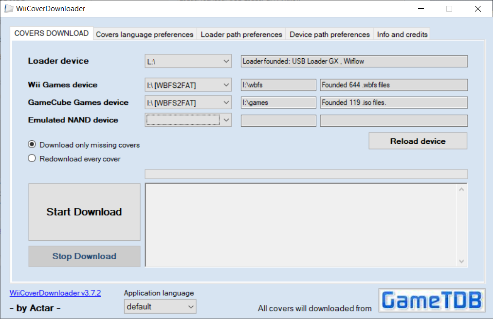

# wii-cover-downloader
Fork of WiiCoverDownloader: https://github.com/WiiDatabase/wii-cover-downloader

* Added usage of wit to scan GameCube iso's to figure out title id's

Which is a fork of WiiCoverDownloader: https://code.google.com/p/wii-cover-downloader

WiiCoverDownloader is a simply (multi-language) Windows application for download covers for the most popular Wii Loader: 

* Wiiflow
* USB Loader GX
* Configurable USB Loader

All covers will downloaded from http://www.gametdb.com 

